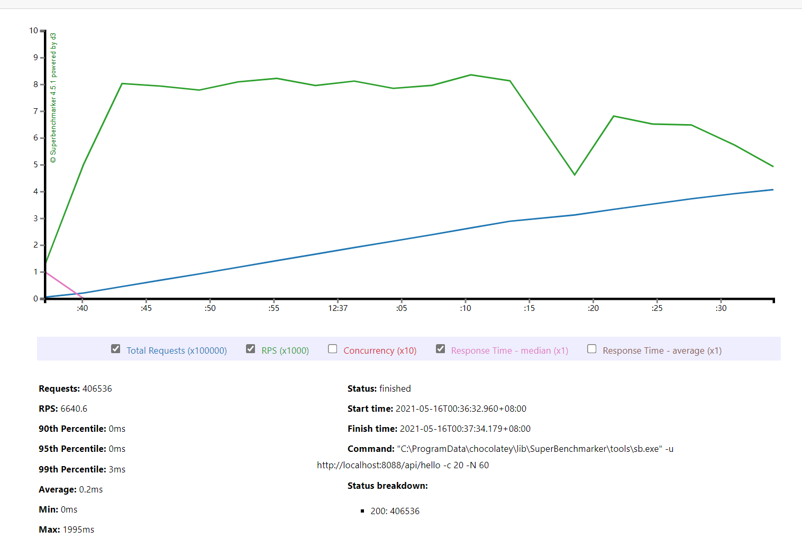
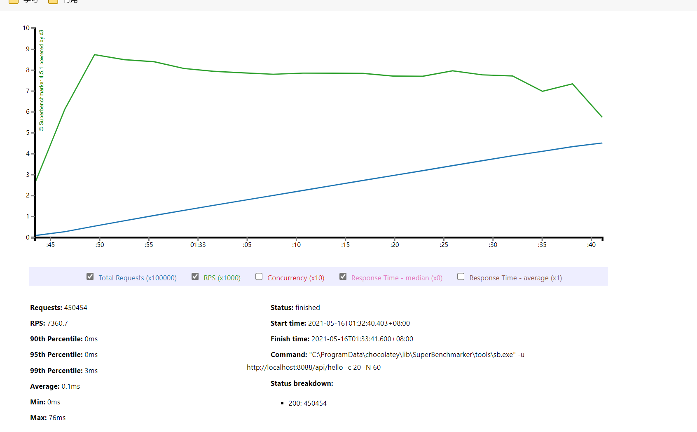
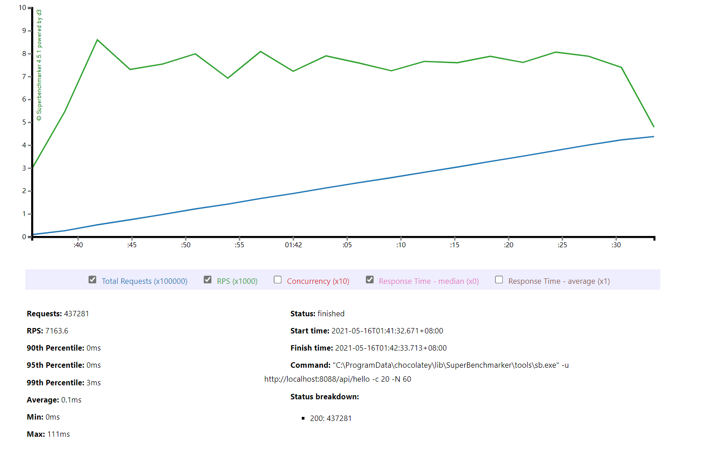

#第2题作业
题目：选做）使用压测工具（wrk 或 sb），演练 gateway-server-0.0.1-SNAPSHOT.jar 示例。

1、使用jdk8默认垃圾收集启动的，

启动命令为：
java -jar -Xmx1g -Xms1g gateway-server-0.0.1-SNAPSHOT.jar

压测命令为：
sb -u http://localhost:8088/api/hello -c 20 -N 60
```
PS C:\WINDOWS\system32> sb -u http://localhost:8088/api/hello -c 20 -N 60
Starting at 2021/5/16 0:36:24
[Press C to stop the test]
406536  (RPS: 5928.5)
---------------Finished!----------------
Finished at 2021/5/16 0:37:33 (took 00:01:08.7654409)
Status 200:    406536

RPS: 6640.6 (requests/second)
Max: 1995ms
Min: 0ms
Avg: 0.2ms

  50%   below 0ms
  60%   below 0ms
  70%   below 0ms
  80%   below 0ms
  90%   below 0ms
  95%   below 0ms
  98%   below 2ms
  99%   below 3ms
99.9%   below 15ms
```



从结果看来在00:01:08.7654409的时间里，发起请求406536次，成功406536次，RPS为6640.6，
最大请求耗时为1995ms,95%的请求耗时在0ms下，98%的耗时耗时在2ms以内，99%的请求耗时在3ms内，
99.9%的请求耗时在15ms内，平均耗时为0.2ms。

2、使用G1
启动命令如下：
java -jar -XX:+UseG1GC -Xms1g -Xmx1g -Xloggc:ftp.logsbG1 -XX:+PrintGCDetails -XX:+PrintGCDateStamps gateway-server-0.0.1-SNAPSHOT.jar

压测命令为：
sb -u http://localhost:8088/api/hello -c 20 -N 60

执行结果如下：
```
PS C:\WINDOWS\system32> sb -u http://localhost:8088/api/hello -c 20 -N 60
Starting at 2021/5/16 1:22:13
[Press C to stop the test]
404668  (RPS: 5990.7)
---------------Finished!----------------
Finished at 2021/5/16 1:23:21 (took 00:01:07.6122070)
Status 200:    404675

RPS: 6624.2 (requests/second)
Max: 604ms
Min: 0ms
Avg: 0.2ms

  50%   below 0ms
  60%   below 0ms
  70%   below 0ms
  80%   below 0ms
  90%   below 0ms
  95%   below 0ms
  98%   below 2ms
  99%   below 3ms
99.9%   below 16ms
```


从结果看来在00:01:07.6122070的时间里，发起请求404675次，成功404675次，RPS为6624.2，
最大请求耗时为604ms,95%的请求耗时在0ms下，98%的耗时耗时在2ms以内，99%的请求耗时在3ms内，
99.9%的请求耗时在16ms内，平均耗时为0.2ms。

3、使用CMS
启动命令：
java -jar -XX:+UseConcMarkSweepGC -Xms1g -Xmx1g -Xloggc:ftp.logsbG1 -XX:+PrintGCDetails -XX:+PrintGCDateStamps gateway-server-0.0.1-SNAPSHOT.jar

压测命令为：
sb -u http://localhost:8088/api/hello -c 20 -N 60

执行结果如下：
```
PS C:\WINDOWS\system32> sb -u http://localhost:8088/api/hello -c 20 -N 60
Starting at 2021/5/16 1:32:36
[Press C to stop the test]
450453  (RPS: 7053.9)
---------------Finished!----------------
Finished at 2021/5/16 1:33:40 (took 00:01:04.0309988)
Status 200:    450454

RPS: 7360.7 (requests/second)
Max: 76ms
Min: 0ms
Avg: 0.1ms

  50%   below 0ms
  60%   below 0ms
  70%   below 0ms
  80%   below 0ms
  90%   below 0ms
  95%   below 0ms
  98%   below 2ms
  99%   below 3ms
99.9%   below 10ms
```


从结果看来在00:01:04.0309988的时间里，发起请求450454次，成功404675次，RPS为7360.7，
最大请求耗时为76ms,95%的请求耗时在0ms下，98%的耗时耗时在2ms以内，99%的请求耗时在3ms内，
99.9%的请求耗时在10ms内，平均耗时为0.1ms。相比前两者，CMS结果压测结果比G1和ParallelGC好。
4、使用SerialGC
启动命令：
java -jar -XX:+UseSerialGC -Xms1g -Xmx1g -Xloggc:ftp.logsbSer -XX:+PrintGCDetails -XX:+PrintGCDateStamps gateway-server-0.0.1-SNAPSHOT.jar
压测命令为：
sb -u http://localhost:8088/api/hello -c 20 -N 60

执行结果如下：
```
PS C:\WINDOWS\system32> sb -u http://localhost:8088/api/hello -c 20 -N 60
Starting at 2021/5/16 1:41:28
[Press C to stop the test]
437270  (RPS: 6804)
437261  (RPS: 6803.9)                   ---------------Finished!----------------
437281  (RPS: 6803.6)                   Finished at 2021/5/16 1:42:32 (took 00:01:04.2893378)
Status 200:    437281

RPS: 7163.6 (requests/second)
Max: 111ms
Min: 0ms
Avg: 0.1ms

  50%   below 0ms
  60%   below 0ms
  70%   below 0ms
  80%   below 0ms
  90%   below 0ms
  95%   below 0ms
  98%   below 2ms
  99%   below 3ms
99.9%   below 9ms
```

从结果看来在00:01:04.2893378的时间里，发起请求437281次，成功404675次，RPS为7163.6，
最大请求耗时为111ms,95%的请求耗时在0ms下，98%的耗时耗时在2ms以内，99%的请求耗时在3ms内，
99.9%的请求耗时在9ms内，平均耗时为0.1ms。

